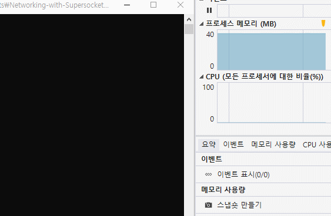

# [Networking with Supersocket](https://github.com/des5141/Networking-with-Supersocket)

Can make online game with ease and quick

1. Go to a file in **GitHub**
1. Extract `Networking_with_Supersocket.gml` in your **Project**
1. Typing basic networking code in `Client` and `Server`
1. **Enjoy!**

[Try it](https://github.com/des5141/Networking-with-Supersocket/tree/master/GMS%201.4)

## Extensions

## Support Git History

### Credits

Based on these amazing projects:

- Liberty🌠 by [Jeong Hyeon Kim](https://github.com/des5141)
- HotKey by [Seonu Kim](https://github.com/Hot-key)

## License

GNU Lesser General Public License v3.0
